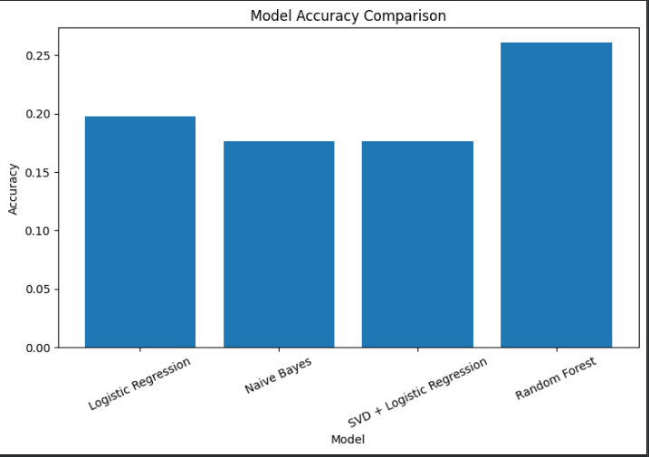
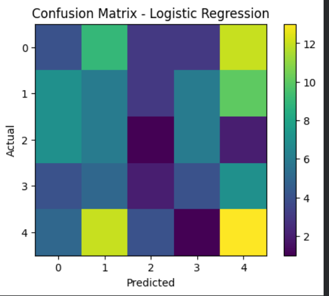

# Personality Prediction System using Machine Learning

## Project Overview

This project predicts personality categories based on questionnaire-based features using machine learning classification models.

The dataset contains features such as:

- Gender
- Age
- Openness
- Neuroticism
- Conscientiousness
- Agreeableness
- Extraversion

The target variable is:

- Personality (Class label)

This project is built for educational purposes and should not be treated as a psychological diagnosis.

---

## Objective

The objective of this project is to build a machine learning workflow that can classify personality types based on user questionnaire responses.

The project includes:

- Data loading
- Data cleaning
- Feature selection
- Categorical encoding
- Model training
- Model evaluation
- Model comparison
- Prediction on unseen test data

---

## Machine Learning Models Used

The following models were trained and compared:

1. Logistic Regression
2. Naive Bayes
3. SVD + Logistic Regression
4. Random Forest

SVD was used for dimensionality reduction before applying Logistic Regression.

---
## Tools and Technologies


-Python
-Pandas
-NumPy
-Matplotlib
-Scikit-learn
-Google Colab
-GitHub


---
## Dataset Features

| Feature | Description |
|---|---|
| Gender | Gender of the person |
| Age | Age of the person |
| Openness | Openness personality trait score |
| Neuroticism | Neuroticism personality trait score |
| Conscientiousness | Conscientiousness trait score |
| Agreeableness | Agreeableness trait score |
| Extraversion | Extraversion trait score |
| Personality (Class label) | Target personality category |

---

## Project Workflow

```text
Dataset
   ↓
Data Cleaning
   ↓
Feature Selection
   ↓
Encoding Categorical Variables
   ↓
Train-Test Split
   ↓
Model Training
   ↓
Model Evaluation
   ↓
Model Comparison
   ↓
Final Prediction
```
## Visualizations

### Model Accuracy Comparison


### Confusion Matrix

